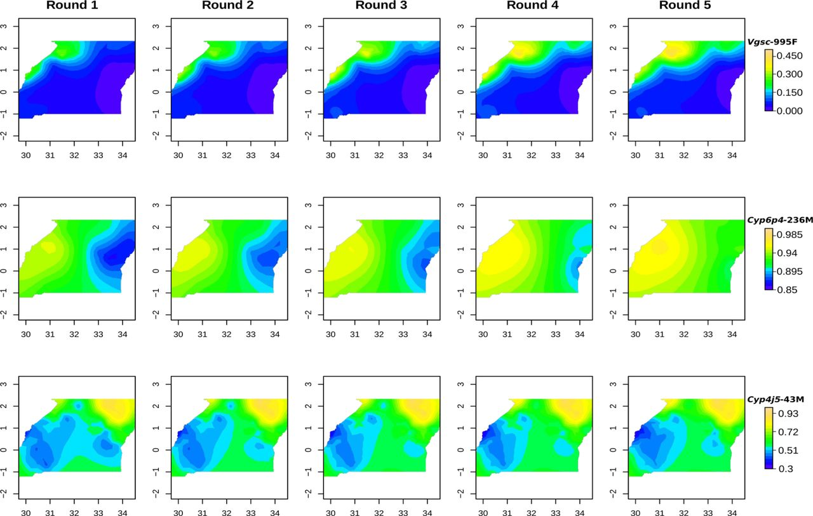

# A really interesting paper

This is the most interesting thing you'll ever read.
What does it look like when you do one sentence per line?
Does it look cool?
I'm not really sure, what is this typewriter mode?
Ah OK, I think I can see how it makes sense now.
Basically, you get a really clean interface for focusing on the line you are currently writing.
This is pretty cool, to be fair.

This should be a new paragraph now. 
I hope so.

## Introduction

<!-- Let's begin by setting the scene. -->

Once upon a time, a man had a **dream**.
That dream led him on a _strange_ and _tortuous_ journey.
A journey into an unusual and strangely quiet corner of reality.

<!-- Now let's build suspense. -->

Why would he embark on such a quest? 
Who can tell. 
But the frustration had been building for some time.

## Results

Certainly this journey led to some interesting discoveries.
I discovered that somehow the people of the world are able to collaborate on written content, without the aid of any kind of structured framework for collaboration.
<!-- This is a comment within a paragraph. I wonder what to say next. -->
This was a surprise!

### The end of the beginning

I learned some math along the way.

$$
x^2 / y
$$

Wasn't that interesting?

> Here is a visible comment.
> It could span multiple lines.

### The beginning of the end

Who would have known it would take so long.
This is a long search.

**Figure 1.** An interesting result.

### A new chapter

So, there is more. Another player enters. 
Obsidian is dark but interesting.
It could only be something good.
And there is a [plugin](https://github.com/chrisgrieser/obsidian-sembr?tab=readme-ov-file) which claims to provide semantic line breaks for you automatically.

## Discussion

So what is really cool about zettlr is the distraction free mode.
It allows you to focus on one sentence at a time.
What a **super** idea!
